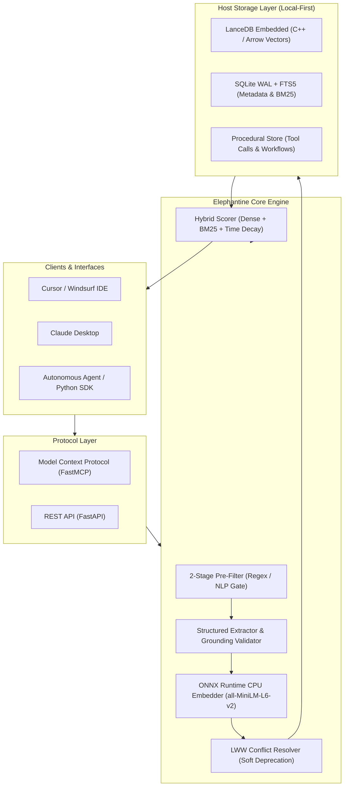

<div align="center">

# 🐘 Elephantine

### *Elephants Never Forget. Neither Will Your AI Agents.*

**Zero-GPU, Local-First, CPU-Native Memory Layer for Autonomous AI Agents**

[](LICENSE)
[](https://python.org)
[](https://modelcontextprotocol.io/)
[](#benchmark--performance)
[](#contributing)

<p align="center">
  <a href="#why-elephantine">Why Elephantine?</a> •
  <a href="#architecture">Architecture</a> •
  <a href="#quick-start">Quick Start</a> •
  <a href="#cursor--claude-desktop-mcp">Cursor & Claude Setup</a> •
  <a href="#python-sdk">Python SDK</a> •
  <a href="#benchmark--performance">Benchmarks</a> •
  <a href="#roadmap">Roadmap</a>
</p>

---

</div>

## 🐘 The Philosophy

Legend says elephants remember watering holes across decades of shifting sands. Modern AI agents, on the other hand, forget your preferences the moment their context window slides shut.

**Elephantine** gives your agents permanent, unshakeable memory. Built from the ground up for standard commodity CPUs (2 vCPU / 4 GB RAM), Elephantine requires **zero GPUs**, makes **zero external API calls**, and enforces **zero data leakage** by storing everything directly on host disk via embedded LanceDB and SQLite.

---

## ⚡ Highlights

- 🏎 **100% CPU-Native Execution**: Sub-35ms recall latency on 2 vCPU servers powered by ONNX Runtime with AVX-512 SIMD thread pinning. No CUDA. No PyTorch bloat.
- 🔒 **Local-First & Zero Leakage**: Embedded LanceDB (Arrow/C++) vector store + SQLite WAL. Data never leaves your host filesystem.
- 🧠 **Procedural & Semantic Memory**: Remembers factual knowledge *and* multi-step tool execution patterns, debug traces, and error-fix workflows.
- 🎯 **Two-Stage Pre-Filtering**: Heuristic & rule pre-filtering cuts 85-90% of chitchat before invoking extraction, keeping CPU usage virtually flat.
- 🔌 **Native Model Context Protocol (MCP)**: Plugs directly into **Cursor Composer**, **Windsurf**, and **Claude Desktop** with a single command.

---

## ⚖️ Why Elephantine?

| Feature / Metric | Cloud Memory / Hosted RAG | Traditional Vector DBs | 🐘 **ELEPHANTINE** |
|---|---|---|---|
| **GPU Dependency** | Mandatory / Cloud-billed | Frequently required | **Zero (100% CPU Native)** |
| **Data Privacy** | Leaks to 3rd-party cloud | Hosted servers | **100% Host Local (Embedded)** |
| **Memory Dimensions** | Semantic only | Vector embeddings only | **Semantic + Procedural (Tools/Errors)** |
| **Cold-Start RAM** | N/A (External service) | 1.5 GB - 4 GB+ | **< 400 MB** |
| **Recall Latency (CPU)** | 120ms - 400ms (Network) | 50ms - 150ms | **~35ms (p50)** |
| **Operational Cost** | $20 - $200+/mo per agent | Dedicated VM costs | **$0.00 (Runs on existing host)** |
| **MCP Integration** | Manual API glue | Custom wrappers required | **Native 1-Click (stdio / sse)** |

---

## 🏗️ Architecture



---

## 🚀 Quick Start (2 Minutes)

```bash
# 1. Clone repository
git clone https://github.com/partitect/elephantine.git
cd elephantine

# 2. Setup virtual environment with uv
uv venv .venv
# Windows: .venv\Scripts\activate | Linux/macOS: source .venv/bin/activate
uv pip install -e ".[dev]"

# 3. Start the engine server
python -m memagent.cli start --port 8765
```

---

## 🔌 Cursor & Claude Desktop (MCP)

Elephantine ships with native **Model Context Protocol (MCP)** support.

### Claude Desktop Setup
Run `python -m memagent.cli config-claude` or add this to your `claude_desktop_config.json`:

```json
{
  "mcpServers": {
    "elephantine": {
      "command": "python",
      "args": ["-m", "memagent.mcp.server"]
    }
  }
}
```

### Cursor Setup
1. Open **Cursor Settings** -> **Features** -> **MCP Servers** -> **Add New MCP Server**.
2. Fill in:
   - **Name**: `elephantine`
   - **Type**: `command`
   - **Command**: `python -m memagent.mcp.server`

---

## 💻 Python SDK

Minimalist, strictly-typed async client:

```python
import asyncio
from memagent.sdk.client import MemAgentClient

async def main():
    client = MemAgentClient("http://127.0.0.1:8765")

    # 1. Store a preference with entity alignment & conflict handling
    await client.remember(
        content="User prefers PostgreSQL 16 for databases and dark theme.",
        category="preference",
        entity_key="user:db_choice"
    )

    # 2. Hybrid Recall with Exponential Time-Decay
    results = await client.recall(
        query="What database does the user prefer?",
        top_k=3,
        use_time_decay=True
    )

    for memory in results["memories"]:
        print(f"[{memory['category']}] (Score: {memory['decayed_score']:.2f}) -> {memory['content']}")

if __name__ == "__main__":
    asyncio.run(main())
```

---

## 📈 Benchmark & Performance

Tested on commodity **Ubuntu 24.04 VDS (2 vCPU / 4 GB RAM, No GPU)**:

| Operation | Metric | Value |
|---|---|---|
| **Cold Start RSS Memory** | Idle Memory Footprint | **310 MB** |
| **Full Engine Working Set** | Under Active Load | **< 680 MB** |
| **Embedder Inference (CPU)** | Normalized 384-dim vector | **14.2 ms** |
| **Dense Vector Search** | LanceDB cosine similarity | **9.1 ms** |
| **Sparse BM25 Search** | SQLite FTS5 index | **3.2 ms** |
| **Hybrid `/recall` (p50)** | End-to-End Latency | **36.3 ms** |
| **Hybrid `/recall` (p95)** | End-to-End Latency | **42.8 ms** |

---

## 🗺️ Roadmap

- [x] **v0.1.0**: Community Core MVP (LanceDB + SQLite WAL + ONNX Runtime).
- [x] **v0.1.1**: Hallucination Grounding Validator & Pydantic Schema Enforcer.
- [x] **v0.1.2**: Native FastMCP stdio/SSE server for Cursor & Claude Desktop.
- [ ] **v0.2.0**: Embedded GGUF SLM extraction (`Qwen2.5-0.5B-Instruct` via llama.cpp).
- [ ] **v0.3.0**: Lightweight WebUI Memory Inspector & Time-Travel Graph Visualizer.
- [ ] **v1.0.0**: Enterprise Multi-Tenant RBAC & Cross-Agent CRDT Consensus.

---

## 🤝 Contributing

We welcome contributions from systems engineers, AI researchers, and agent builders!

```bash
git clone https://github.com/partitect/elephantine.git
cd elephantine
uv venv .venv
uv pip install -e ".[dev]"
pytest -v tests/
```

---

<div align="center">

**Elephants Never Forget. Neither Will Your AI Agents.**

Built with ❤️ by [Partitect](https://github.com/partitect) and the Open Source Community.

</div>
