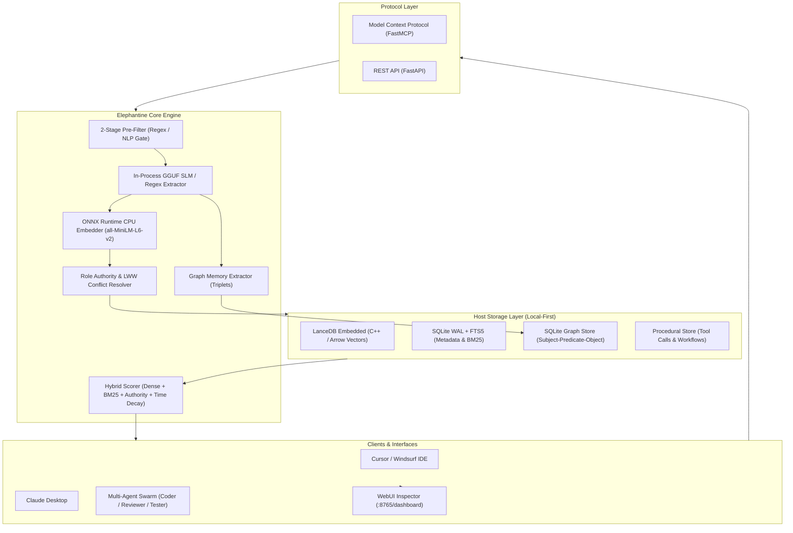

<div align="center">

# 🐘 Elephantine

### *Elephants Never Forget. Neither Will Your AI Agents.*

**Zero-GPU, Local-First, CPU-Native Memory Layer for Autonomous AI Agents**

[](https://pypi.org/project/elephantine/)
[](https://github.com/partitect/elephantine/actions/workflows/ci.yml)
[](LICENSE)
[](https://python.org)
[](https://modelcontextprotocol.io/)
[](#benchmark--performance)
[](#contributing)

<p align="center">
  <a href="#why-elephantine">Why Elephantine?</a> •
  <a href="#architecture">Architecture</a> •
  <a href="#quick-start">Quick Start</a> •
  <a href="#multi-agent-shared-workspace">Multi-Agent Workspace</a> •
  <a href="#webui-dashboard">Dashboard</a> •
  <a href="#cursor--claude-desktop-mcp">Cursor & Claude Setup</a> •
  <a href="#python-sdk">Python SDK</a> •
  <a href="#benchmark--performance">Benchmarks</a>
</p>

---

<br/>

<a href="#webui-dashboard">
  
</a>

<br/>

</div>

## 🐘 The Philosophy

Legend says elephants remember watering holes across decades of shifting sands. Modern AI agents, on the other hand, forget your preferences the moment their context window slides shut.

**Elephantine** gives your agents permanent, unshakeable memory. Built from the ground up for standard commodity CPUs (2 vCPU / 4 GB RAM), Elephantine requires **zero GPUs**, makes **zero external API calls**, and enforces **zero data leakage** by storing everything directly on host disk via embedded LanceDB and SQLite.

---

## ⚡ Highlights

- 🏎 **100% CPU-Native Execution**: Sub-35ms recall latency on 2 vCPU servers powered by ONNX Runtime with AVX-512 SIMD thread pinning. No CUDA. No PyTorch bloat.
- 👥 **Multi-Agent Shared Workspace**: Seamless memory pooling (`workspace_id`) across teams (Coder, Tester, Architect) with **Role-Based Authority Consensus** (`role_authority`) preventing junior agents from overwriting senior architectural decisions.
- 📊 **Built-in WebUI Inspector**: Real-time interactive dashboard (`/dashboard`) showing live engine KPIs, memory ledgers, conflict histories, and entity graph relationships.
- 🦙 **In-Process GGUF SLM Extraction**: Local structured memory extraction via embedded `llama-cpp-python` (`Qwen2.5-0.5B-Instruct`), requiring zero background LLM servers.
- 🕸 **Graph Memory & Knowledge Triplets**: Native subject-predicate-object semantic graphs (`/graph/query`) integrated directly into the hybrid retrieval pipeline.
- 🔒 **Local-First & Zero Leakage**: Embedded LanceDB (Arrow/C++) vector store + SQLite WAL. Data never leaves your host filesystem.
- 🔌 **Native Model Context Protocol (MCP)**: Plugs directly into **Cursor Composer**, **Windsurf**, and **Claude Desktop** with a single command.

---

<a id="why-elephantine"></a>
## ⚖️ Why Elephantine?

| Feature / Metric | Cloud Memory / Hosted RAG | Traditional Vector DBs | 🐘 **ELEPHANTINE** |
|---|---|---|---|
| **GPU Dependency** | Mandatory / Cloud-billed | Frequently required | **Zero (100% CPU Native)** |
| **Data Privacy** | Leaks to 3rd-party cloud | Hosted servers | **100% Host Local (Embedded)** |
| **Memory Dimensions** | Semantic only | Vector embeddings only | **Semantic + Procedural + Graph** |
| **Multi-Agent Teams** | Shared tenant silos | No built-in consensus | **Workspace Pooling + Role Authority** |
| **Cold-Start RAM** | N/A (External service) | 1.5 GB - 4 GB+ | **< 400 MB** |
| **Recall Latency (CPU)** | 120ms - 400ms (Network) | 50ms - 150ms | **~35ms (p50)** |
| **Operational Cost** | $20 - $200+/mo per agent | Dedicated VM costs | **$0.00 (Runs on existing host)** |
| **MCP Integration** | Manual API glue | Custom wrappers required | **Native 1-Click (stdio / sse)** |

---

<a id="architecture"></a>
## 🏗️ Architecture



---

<a id="quick-start"></a>
## 🚀 Quick Start (30 Seconds)

### Option A: Install via pip (Recommended)
```bash
pip install elephantine

# Start the engine server & dashboard
elephantine start --port 8765
```

### Option B: From Source (For Contributors)
```bash
# 1. Clone repository
git clone https://github.com/partitect/elephantine.git
cd elephantine

# 2. Setup virtual environment with uv
uv venv .venv
# Windows: .venv\Scripts\activate | Linux/macOS: source .venv/bin/activate
uv pip install -e ".[dev]"

# 3. Start the engine server & dashboard
elephantine start --port 8765
```

Open your browser to [http://localhost:8765/dashboard](http://localhost:8765/dashboard) to view the live Memory Inspector!

---

<a id="multi-agent-shared-workspace"></a>
## 👥 Multi-Agent Shared Workspace

Coordinate agent teams (e.g. Coder, Tester, Architect) with persistent memory pools and hierarchical authority protection:

```python
from memagent.client import ElephantineClient

# Connect to local Elephantine daemon
client = ElephantineClient("http://127.0.0.1:8765")

# 1. Lead Architect sets architectural baseline (Authority: 1.0)
client.remember(
    content="Database must strictly run PostgreSQL 16 with pgvector extension.",
    category="architecture",
    entity_key="project:db_engine",
    workspace_id="phoenix-core",
    role_authority=1.0
)

# 2. Junior Coder attempts to change database (Authority: 0.3)
# -> REJECTED by Role Authority Consensus (protected against lower authority)
client.remember(
    content="Let's switch project database to SQLite for simplicity.",
    category="architecture",
    entity_key="project:db_engine",
    workspace_id="phoenix-core",
    role_authority=0.3
)

# 3. Tester Agent recalls workspace memories (Authority-weighted re-ranking)
results = client.recall(
    query="Which database engine are we using?",
    workspace_id="phoenix-core"
)

# Output guarantees PostgreSQL 16 is preserved:
# [architecture] (Authority: 1.0) -> Database must strictly run PostgreSQL 16...
```

---

<a id="webui-dashboard"></a>
## 🖥️ WebUI Dashboard

Elephantine includes a built-in, lightweight Memory Inspector accessible at `http://localhost:8765/dashboard`:

- **Real-Time Memory Ledger**: Inspect active vs deprecated memories, view revision counts and superseded states.
- **Authority & Conflict Tracking**: Monitor role-based modifications and LWW (Last-Write-Wins) deprecation chains.
- **Knowledge Graph Viewer**: Browse extracted subject-predicate-object relationship triplets.
- **Live Search & Filter**: Test hybrid dense + BM25 search queries interactively.

---

<a id="cursor--claude-desktop-mcp"></a>
## 🔌 Cursor & Claude Desktop (MCP)

Elephantine ships with native **Model Context Protocol (MCP)** support.

### Claude Desktop Setup
Run `python -m memagent.cli config-claude` or add this to your `claude_desktop_config.json`:

```json
{
  "mcpServers": {
    "elephantine": {
      "command": "python",
      "args": ["-m", "memagent.mcp.server"]
    }
  }
}
```

### Cursor Setup
1. Open **Cursor Settings** -> **Features** -> **MCP Servers** -> **Add New MCP Server**.
2. Fill in:
   - **Name**: `elephantine`
   - **Type**: `command`
   - **Command**: `python -m memagent.mcp.server`

---

<a id="python-sdk"></a>
## 💻 Python SDK & LangChain Integration

Elephantine provides sync and async clients plus native LangChain memory integration:

```python
import asyncio
from memagent.client import AsyncElephantineClient, ElephantineLangChainMemory

async def main():
    async with AsyncElephantineClient("http://127.0.0.1:8765") as client:
        # Remember with semantic entity alignment
        await client.remember(
            content="User prefers pytest with async test runners.",
            category="preference",
            entity_key="dev:test_runner",
            workspace_id="dev-team",
            role_authority=0.8
        )

        # Recall memories with time decay and workspace filtering
        res = await client.recall(
            query="test runner preferences",
            workspace_id="dev-team",
            top_k=3
        )
        print("Recalled:", res)

    # LangChain Memory Adapter
    chain_memory = ElephantineLangChainMemory(
        base_url="http://127.0.0.1:8765",
        workspace_id="dev-team"
    )
    chain_memory.save_context({"input": "Hello"}, {"output": "I remember your preferences!"})

if __name__ == "__main__":
    asyncio.run(main())
```

---

<a id="benchmark--performance"></a>
## 📈 Benchmark & Performance

Tested on commodity **Ubuntu 24.04 VDS (2 vCPU / 4 GB RAM, No GPU)**:

| Operation | Metric | Value |
|---|---|---|
| **Cold Start RSS Memory** | Idle Memory Footprint | **310 MB** |
| **Full Engine Working Set** | Under Active Load | **< 680 MB** |
| **Embedder Inference (CPU)** | Normalized 384-dim vector | **14.2 ms** |
| **Dense Vector Search** | LanceDB cosine similarity | **9.1 ms** |
| **Sparse BM25 Search** | SQLite FTS5 index | **3.2 ms** |
| **Hybrid `/recall` (p50)** | End-to-End Latency | **36.3 ms** |
| **Hybrid `/recall` (p95)** | End-to-End Latency | **42.8 ms** |

---

## 🗺️ Roadmap

- [x] **v0.1.0**: Community Core MVP (LanceDB + SQLite WAL + ONNX Runtime).
- [x] **v0.1.1**: Hallucination Grounding Validator & Pydantic Schema Enforcer.
- [x] **v0.1.2**: Native FastMCP stdio/SSE server for Cursor & Claude Desktop.
- [x] **v0.2.0**: Embedded GGUF SLM extraction (`Qwen2.5-0.5B-Instruct` via llama.cpp).
- [x] **v0.2.5**: Graph Memory & Entity Triplet Extraction (`/graph/query`).
- [x] **v0.3.0**: Lightweight WebUI Memory Inspector & Time-Travel Graph Visualizer.
- [x] **v0.3.5**: Multi-Agent Shared Workspace & Role-Based Authority Consensus (`workspace_id`, `role_authority`).
- [ ] **v1.0.0**: Enterprise Multi-Tenant RBAC & Cross-Agent CRDT Consensus.

---

## 🤝 Contributing

We welcome contributions from systems engineers, AI researchers, and agent builders!

```bash
git clone https://github.com/partitect/elephantine.git
cd elephantine
uv venv .venv
uv pip install -e ".[dev]"
pytest -v tests/
```

---

## 🌟 Star History

<div align="center">

[](https://star-history.com/#partitect/elephantine&Date)

</div>

---

<div align="center">

**Elephants Never Forget. Neither Will Your AI Agents.**

Built with ❤️ by [Partitect](https://github.com/partitect) and the Open Source Community.

</div>
