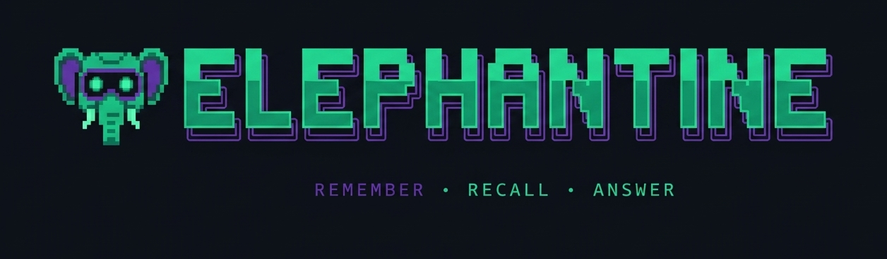
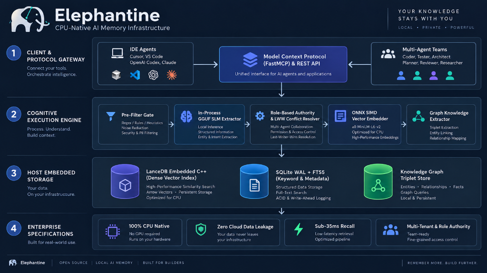

<p align="center">
  
</p>

<div align="center">

# 🐘 Elephantine

### *Elephants Never Forget. Neither Will Your AI Agents.*

**Zero-GPU, Local-First, CPU-Native Memory Layer for Autonomous AI Agents**

[](https://pypi.org/project/elephantine/)
[](https://github.com/partitect/elephantine/actions/workflows/ci.yml)
[](LICENSE)
[](https://python.org)
[](https://modelcontextprotocol.io/)
[](#benchmark--performance)
[](#contributing)

<p align="center">
  <a href="#why-elephantine">Why Elephantine?</a> •
  <a href="#architecture">Architecture</a> •
  <a href="#quick-start">Quick Start</a> •
  <a href="#multi-agent-shared-workspace">Multi-Agent Workspace</a> •
  <a href="#webui-dashboard">Dashboard & Graph</a> •
  <a href="#ide--agent-setup-mcp">1-Click IDE Setup</a> •
  <a href="#cli-terminal-commands">Terminal CLI</a> •
  <a href="#sdks--integrations">SDKs (Python & TS)</a> •
  <a href="#enterprise-rbac--security">Enterprise RBAC</a> •
  <a href="#benchmark--performance">Benchmarks</a>
</p>

<p align="center">
  <b>Translations:</b>
  <a href="README.md">English</a> |
  <a href="i18n/README_tr.md">Türkçe</a> |
  <a href="i18n/README_zh.md">简体中文</a> |
  <a href="i18n/README_es.md">Español</a> |
  <a href="i18n/README_ja.md">日本語</a>
</p>

---

</div>

## 🐘 The Philosophy

Legend says elephants remember watering holes across decades of shifting sands. Modern AI agents, on the other hand, forget your preferences the moment their context window slides shut.

**Elephantine** gives your agents permanent, unshakeable memory. Built from the ground up for standard commodity CPUs (2 vCPU / 4 GB RAM), Elephantine requires **zero GPUs**, makes **zero external API calls**, and enforces **zero data leakage** by storing everything directly on host disk via embedded LanceDB and SQLite.

---

## ⚡ Highlights

- 🏎 **100% CPU-Native Execution**: Sub-35ms recall latency on 2 vCPU servers powered by ONNX Runtime with AVX-512 SIMD thread pinning. No CUDA. No PyTorch bloat.
- 👥 **Multi-Agent Shared Workspace**: Seamless memory pooling (`workspace_id`) across teams (Coder, Tester, Architect) with **Role-Based Authority Consensus** (`role_authority`) preventing junior agents from overwriting senior architectural decisions.
- 📊 **Built-in WebUI Inspector & Knowledge Graph**: Real-time interactive dashboard (`/dashboard`) featuring memory ledgers and a **Cytoscape.js interactive graph visualizer** for entity relationships.
- 🦙 **In-Process GGUF SLM Extraction**: Local structured memory extraction via embedded `llama-cpp-python` (`Qwen2.5-0.5B-Instruct`), requiring zero background LLM servers.
- 🕸 **Graph Memory & Knowledge Triplets**: Native subject-predicate-object semantic graphs (`/graph/query`) integrated directly into the hybrid retrieval pipeline.
- ⚙️ **Procedural Memory & Workflow Tracking**: Records tool execution histories and learned multi-step procedural patterns (`/procedural/track`).
- 🔒 **Local-First & Zero Leakage**: Embedded LanceDB (Arrow/C++) vector store + SQLite WAL. Data never leaves your host filesystem.
- 🔌 **Universal Agent Support (MCP & REST)**: Plugs directly into **Google Antigravity**, **OpenAI Codex**, **Cursor Composer**, **GitHub Copilot**, **Windsurf**, and **Claude Desktop** with 1-click automatic CLI installers.
- 🛡️ **Enterprise RBAC & Security**: Configurable `RoleBasedAuthEngine` with granular role permissions (`admin`, `architect`, `editor`, `viewer`) and API Key / Bearer token enforcement.

---

<a id="why-elephantine"></a>
## ⚖️ Why Elephantine?

| Feature / Metric | Cloud Memory / Hosted RAG | Traditional Vector DBs | 🐘 **ELEPHANTINE** |
|---|---|---|---|
| **GPU Dependency** | Mandatory / Cloud-billed | Frequently required | **Zero (100% CPU Native)** |
| **Data Privacy** | Leaks to 3rd-party cloud | Hosted servers | **100% Host Local (Embedded)** |
| **Memory Dimensions** | Semantic only | Vector embeddings only | **Semantic + Procedural + Graph** |
| **Multi-Agent Teams** | Shared tenant silos | No built-in consensus | **Workspace Pooling + Role Authority** |
| **Cold-Start RAM** | N/A (External service) | 1.5 GB - 4 GB+ | **< 400 MB** |
| **Recall Latency (CPU)** | 120ms - 400ms (Network) | 50ms - 150ms | **~35ms (p50)** |
| **Operational Cost** | $20 - $200+/mo per agent | Dedicated VM costs | **$0.00 (Runs on existing host)** |
| **MCP Integration** | Manual API glue | Custom wrappers required | **Native 1-Click (stdio / sse)** |

---

<a id="architecture"></a>
## 🏗️ Architecture

<br/>

<div align="center">
  
</div>

<br/>

---

<a id="quick-start"></a>
## 🚀 Quick Start & CLI Installation

### 1. Install the Elephantine CLI

Installing Elephantine automatically makes the `elephantine` command globally available in your terminal:

```bash
# Recommended: Standalone global CLI via pipx
pipx install elephantine

# Or with uv
uv tool install elephantine

# Or standard pip
pip install elephantine
```

> [!TIP]
> Once installed, you have instant access to all CLI commands (`elephantine start`, `elephantine install-antigravity`, `elephantine remember`, etc.). If your terminal PATH is not configured for Python scripts, you can also run `python -m elephantine.cli <command>`.

### 2. Start the Engine Server & WebUI Dashboard
```bash
elephantine start --port 8765
```
Open your browser to [http://localhost:8765/dashboard](http://localhost:8765/dashboard) to view the live Memory Inspector!

### Option B: From Source (For Contributors)
```bash
# 1. Clone repository
git clone https://github.com/partitect/elephantine.git
cd elephantine

# 2. Setup virtual environment with uv
uv venv .venv
# Windows: .venv\Scripts\activate | Linux/macOS: source .venv/bin/activate
uv pip install -e ".[dev]"

# 3. Start the engine server & dashboard
elephantine start --port 8765
```

---

<a id="ide--agent-setup-mcp"></a>
## 🔌 1-Click IDE & Agent Setup (MCP)

Elephantine connects to all major agentic IDEs, coding assistants, and desktop AI clients via native **Model Context Protocol (MCP)**.

### ⚡ 1-Second Automatic CLI Installers
With the `elephantine` CLI installed, configure your favorite AI agent environment in seconds with zero manual JSON editing:


```bash
# Google Antigravity (AGY)
elephantine install-antigravity

# OpenAI Codex & GitHub Copilot
elephantine install-codex

# Cursor Composer & Editor
elephantine install-cursor

# Claude Desktop
elephantine install-claude

# VS Code Workspace (.vscode/settings.json)
elephantine install-vscode
```

### Manual Configuration
You can also view ready-to-paste configurations manually anytime:
```bash
elephantine config-antigravity
elephantine config-codex
elephantine config-cursor
elephantine config-claude
```

---

<a id="cli-terminal-commands"></a>
## 💻 Direct Terminal CLI Commands

Manage and inspect memories directly from your terminal without opening a browser or writing scripts:

```bash
# 1. Remember a fact with workspace and authority
elephantine remember "PostgreSQL 16 with pgvector extension is required" \
  --workspace phoenix-core \
  --category architecture \
  --authority 1.0

# 2. Recall memories via hybrid dense + BM25 search
elephantine recall "which database engine are we using?" \
  --workspace phoenix-core \
  --top-k 3

# 3. Register a proactive trigger (recurring or absolute)
elephantine trigger-create "Today is Friday! Weekly progress report is due at 17:00." \
  --trigger "weekly:FRI:17:00" \
  --workspace phoenix-core \
  --agent coder_agent

# 4. Pull pending unacknowledged proactive alerts
elephantine trigger-pending --agent coder_agent --workspace phoenix-core
```

---

<a id="proactive-memory-triggers"></a>
## 🔔 Proactive Memory Triggers (Autonomous Memory Feeds)

Traditional memory systems (such as Mem0) are **purely reactive**: an AI agent must explicitly execute a query (`/recall`) to know what it remembered.

**Elephantine introduces Proactive Memory Triggers**: The engine actively stages alerts and feeds critical context to agents **without requiring prompt lookups**, based on:
- **Recurring Schedules**: `weekly:FRI:17:00` (e.g. weekly reports), `daily:09:00` (morning standups).
- **Time Intervals**: `every:30m`, `every:2h`, `every:1d` (cache invalidations, health checks).
- **Exact Timestamps**: ISO-8601 datetimes (`2026-09-15T10:00:00Z`).

### Delivery Modes:
1. **Pull-Based Check-in (Zero-Latency)**: Ajan seans başlattığında ya da döngü içinde bekleyen bildirimleri çeker:
   ```python
   alerts = client.get_pending_alerts(target_agent="coder_agent", workspace_id="phoenix-core")
   for alert in alerts:
       print(f"Proactive context: {alert['content']}")
       client.acknowledge_alert(alert['trigger_id'])
   ```
2. **Real-Time Streaming (SSE)**: Listen to live proactive triggers via `GET /proactive/stream`.
3. **HTTP Webhooks**: Configure `webhook_url` to receive instant asynchronous POST notifications.

---

<a id="multi-agent-shared-workspace"></a>
## 👥 Multi-Agent Shared Workspace

Coordinate agent teams (e.g. Coder, Tester, Architect) with persistent memory pools and hierarchical authority protection:

```python
from elephantine.client import ElephantineClient

# Connect to local Elephantine daemon
client = ElephantineClient("http://127.0.0.1:8765")

# 1. Lead Architect sets architectural baseline (Authority: 1.0)
client.remember(
    content="Database must strictly run PostgreSQL 16 with pgvector extension.",
    category="architecture",
    entity_key="project:db_engine",
    workspace_id="phoenix-core",
    role_authority=1.0
)

# 2. Junior Coder attempts to change database (Authority: 0.3)
# -> REJECTED by Role Authority Consensus (protected against lower authority)
client.remember(
    content="Let's switch project database to SQLite for simplicity.",
    category="architecture",
    entity_key="project:db_engine",
    workspace_id="phoenix-core",
    role_authority=0.3
)

# 3. Tester Agent recalls workspace memories (Authority-weighted re-ranking)
results = client.recall(
    query="Which database engine are we using?",
    workspace_id="phoenix-core"
)

# Output guarantees PostgreSQL 16 is preserved:
# [architecture] (Authority: 1.0) -> Database must strictly run PostgreSQL 16...
```

---

<a id="webui-dashboard"></a>
## 🖥️ WebUI Dashboard & Interactive Knowledge Graph

Elephantine includes a built-in, lightweight inspector accessible at `http://localhost:8765/dashboard`:

- **Real-Time Memory Ledger**: Inspect active vs deprecated memories, view revision counts and superseded states.
- **🕸 Interactive Knowledge Graph (Cytoscape.js)**: Explore semantic entities and subject-predicate-object triplets with force-directed (CoSE), circular, and concentric layouts.
- **Click-to-Inspect**: Tap any node or relationship edge to view confidence scores, source memories, and linked attributes.
- **Authority & Conflict Tracking**: Monitor role-based modifications and LWW (Last-Write-Wins) deprecation chains.

---

<a id="sdks--integrations"></a>
## 💻 SDKs & Integrations

### 1. Python SDK & LangChain Integration
```python
import asyncio
from elephantine.client import AsyncElephantineClient, ElephantineLangChainMemory

async def main():
    async with AsyncElephantineClient("http://127.0.0.1:8765") as client:
        await client.remember(
            content="User prefers pytest with async test runners.",
            category="preference",
            entity_key="dev:test_runner",
            workspace_id="dev-team",
            role_authority=0.8
        )

        res = await client.recall(
            query="test runner preferences",
            workspace_id="dev-team",
            top_k=3
        )
        print("Recalled:", res)

    # LangChain Memory Adapter
    chain_memory = ElephantineLangChainMemory(
        base_url="http://127.0.0.1:8765",
        workspace_id="dev-team"
    )
    chain_memory.save_context({"input": "Hello"}, {"output": "I remember your preferences!"})

if __name__ == "__main__":
    asyncio.run(main())
```

### 2. TypeScript / Node.js SDK (`@elephantine/sdk`)
Available in `sdks/typescript/`:

```typescript
import { ElephantineClient } from '@elephantine/sdk';

const client = new ElephantineClient('http://127.0.0.1:8765');

// Store memory
await client.remember({
  content: 'Production deployments occur on Tuesdays at 10:00 UTC.',
  category: 'devops',
  workspaceId: 'infra-team',
  roleAuthority: 0.9
});

// Recall memory
const res = await client.recall({
  query: 'deployment schedule',
  workspaceId: 'infra-team'
});
console.log(res.memories);
```

---

<a id="enterprise-rbac--security"></a>
## 🛡️ Enterprise RBAC & Security

For multi-user teams and production deployments, Elephantine includes modular Role-Based Access Control:

* **Predefined Roles**:
  - `admin`: Full unrestricted access (`read`, `write`, `delete`, `admin`).
  - `architect`: Can read, write, and delete memories across all categories.
  - `editor`: Can read and write active memories.
  - `viewer`: Read-only recall access. Write and delete operations are rejected with HTTP 403 Forbidden.
* **Token Authentication**:
  - Enable with `ELEPHANTINE_AUTH_ENABLED=true` (or `MEMAGENT_AUTH_ENABLED=true`).
  - Authenticate requests via `X-API-Key: <key>` header or `Authorization: Bearer <key>`.
  - Default Community mode (`AUTH_ENABLED=false`) runs with zero configuration and zero friction.

---

<a id="benchmark--performance"></a>
## 📈 Benchmark & Performance

Tested on commodity **Ubuntu 24.04 VDS (2 vCPU / 4 GB RAM, No GPU)**:

| Operation | Metric | Value |
|---|---|---|
| **Cold Start RSS Memory** | Idle Memory Footprint | **310 MB** |
| **Full Engine Working Set** | Under Active Load | **< 680 MB** |
| **Embedder Inference (CPU)** | Normalized 384-dim vector | **14.2 ms** |
| **Dense Vector Search** | LanceDB cosine similarity | **9.1 ms** |
| **Sparse BM25 Search** | SQLite FTS5 index | **3.2 ms** |
| **Hybrid `/recall` (p50)** | End-to-End Latency | **36.3 ms** |
| **Hybrid `/recall` (p95)** | End-to-End Latency | **42.8 ms** |

---

## 🗺️ Roadmap

- [x] **v0.1.0**: Community Core MVP (LanceDB + SQLite WAL + ONNX Runtime).
- [x] **v0.1.1**: Hallucination Grounding Validator & Pydantic Schema Enforcer.
- [x] **v0.1.2**: Native FastMCP stdio/SSE server for Cursor & Claude Desktop.
- [x] **v0.2.0**: Embedded GGUF SLM extraction (`Qwen2.5-0.5B-Instruct` via llama.cpp).
- [x] **v0.2.5**: Graph Memory & Entity Triplet Extraction (`/graph/query`).
- [x] **v0.3.0**: Lightweight WebUI Memory Inspector & Time-Travel Graph Visualizer.
- [x] **v0.3.5**: Multi-Agent Shared Workspace & Role-Based Authority Consensus (`workspace_id`, `role_authority`).
- [x] **v0.3.8**: 1-Click IDE Installers (Antigravity, Codex, Cursor, Claude, VS Code) & Cytoscape.js Interactive Graph.
- [x] **v0.4.0**: TypeScript / Node.js SDK & Enterprise RBAC Security Layer.
- [ ] **v1.0.0**: Cross-Agent Distributed CRDT Consensus & Multi-Node Cluster Sync.

---

## 🤝 Contributing

We welcome contributions from systems engineers, AI researchers, and agent builders!

```bash
git clone https://github.com/partitect/elephantine.git
cd elephantine
uv venv .venv
uv pip install -e ".[dev]"
pytest -v tests/
```

---

<a id="enterprise-commercial-support"></a>
## 💼 Enterprise, Cloud & Commercial Support

Are you building production agent swarms or looking for an enterprise-grade, privacy-first cognitive memory layer?

| Offering | Target Audience | Features | Link |
|---|---|---|---|
| **Community Edition** | Developers & Builders | Apache 2.0 open-source, 100% local, zero external dependencies | [Documentation](#quick-start) |
| **Elephantine Cloud** | Remote Developers & Teams | Cross-device memory sync, managed endpoints, automated backups | [Join Cloud Waitlist](mailto:contact@partitect.com?subject=Elephantine%20Cloud%20Waitlist) |
| **Enterprise Edition** | Corporations, Healthcare, Fintech | On-premise deployment, SOC2/HIPAA compliance reports, SAML/SSO, Custom SLA | [Contact Enterprise](mailto:contact@partitect.com?subject=Elephantine%20Enterprise%20Inquiry) |
| **Custom Agent Consulting** | AI Agencies & Enterprise Teams | Custom Knowledge Graph extraction, dedicated integrations, architecture audits | [Book Architecture Call](mailto:contact@partitect.com?subject=Elephantine%20Architecture%20Consulting) |

> [!TIP]
> **Need a dedicated SLA, custom memory extractor, or private on-premise deployment?**  
> Reach out directly to our engineering team at [contact@partitect.com](mailto:contact@partitect.com).

---

## 🌟 Star History

<div align="center">

[](https://star-history.com/#partitect/elephantine&Date)

</div>

---

<div align="center">

**Elephants Never Forget. Neither Will Your AI Agents.**

Built with ❤️ by [Partitect](https://github.com/partitect) and the Open Source Community.

</div>
