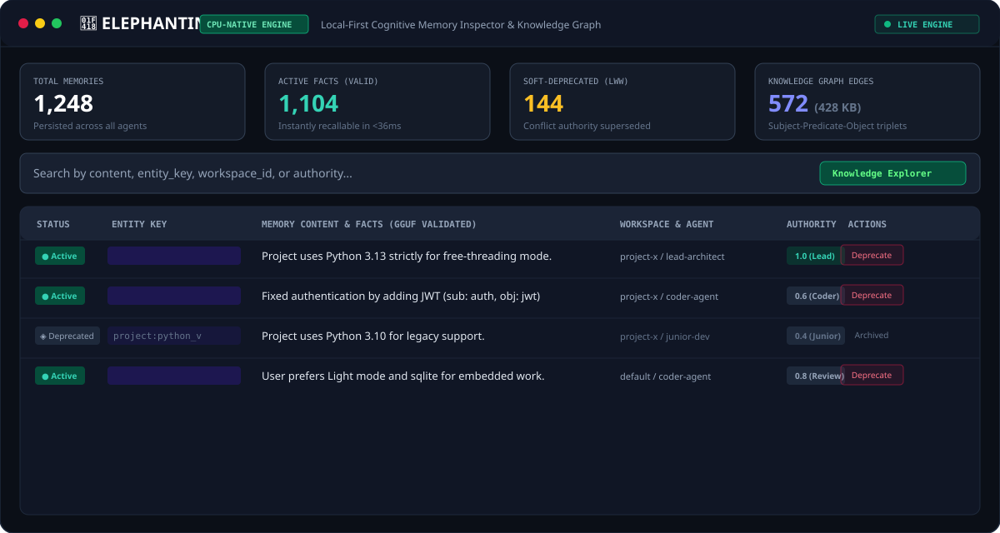

<div align="center">

# 🐘 Elephantine

### *象は決して忘れない。あなたのAIエージェントも同じです。*

**自律型AIエージェントのためのGPU不要・ローカルファースト・CPUネイティブ記憶レイヤー**

[](https://pypi.org/project/elephantine/)
[](https://github.com/partitect/elephantine/actions/workflows/ci.yml)
[](../LICENSE)
[](https://python.org)
[](https://modelcontextprotocol.io/)
[](#ベンチマークと性能評価-benchmarks)
[](#コントリビューション)

<p align="center">
  <a href="#なぜ-elephantine-なのか">なぜ Elephantine なのか？</a> •
  <a href="#アーキテクチャ">アーキテクチャ</a> •
  <a href="#クイックスタート">クイックスタート</a> •
  <a href="#マルチエージェント共有ワークスペース">共有ワークスペース</a> •
  <a href="#webui-ダッシュボード--ナレッジグラフ">ダッシュボード & グラフ</a> •
  <a href="#1クリック-ide-環境設定-mcp">1クリック IDE 設定</a> •
  <a href="#ターミナル-cli-コマンド">ターミナル CLI</a> •
  <a href="#各言語-sdk-python--ts">SDK (Python & TS)</a> •
  <a href="#エンタープライズ-rbac--セキュリティ">エンタープライズ RBAC</a> •
  <a href="#ベンチマークと性能評価-benchmarks">ベンチマーク</a>
</p>

<p align="center">
  <b>言語 / Translations:</b>
  <a href="../README.md">English</a> |
  <a href="README_tr.md">Türkçe</a> |
  <a href="README_zh.md">简体中文</a> |
  <a href="README_es.md">Español</a> |
  <a href="README_ja.md">日本語</a>
</p>

---

<br/>

<a href="#webui-ダッシュボード--ナレッジグラフ">
  
</a>

<br/>

</div>

## 🐘 開発思想

伝説によれば、象は何十年も流動する砂漠の中でかつてあった水場を決して忘れないと言われています。一方、現代のAIエージェントはコンテキストウィンドウ（Context Window）が閉じた瞬間に、ユーザーの好みやこれまでの決定事項をすべて忘れてしまいます。

**Elephantine** は、エージェントに永続的で揺るぎない記憶を提供します。一般的な標準CPU（2 vCPU / 4 GB RAM）向けにゼロから設計された Elephantine は、**GPUを一切必要とせず**、**外部APIへの通信も行わず**、組み込みの LanceDB と SQLite を使用してホストディスクに直接永続化することで**データ漏洩ゼロ**を保証します。

---

## ⚡ 主な特徴

- 🏎 **100% CPUネイティブ実行**: ONNX Runtime と AVX-512 SIMD スレッド最適化により、2 vCPU サーバー環境で 35ms 未満のリコールレイテンシを実現。CUDA不要、重厚な PyTorch 依存もありません。
- 👥 **マルチエージェント共有ワークスペース**: 開発チーム（Coder、Tester、Architect）間でメモリプール（`workspace_id`）をシームレスに共有。**ロールベース権限コンセンサス**（`role_authority`）により、ジュニアエージェントがシニアアーキテクトの設計判断を誤って上書きすることを防止します。
- 📊 **組み込み WebUI & インタラクティブ・ナレッジグラフ**: リアルタイムダッシュボード（`/dashboard`）により、記憶台帳と **Cytoscape.js** による関係グラフの可視化ネットワークを操作可能。
- 🦙 **インプロセス GGUF SLM 抽出**: 外部LLMサーバーを立てることなく、組み込み `llama-cpp-python`（`Qwen2.5-0.5B-Instruct`）によりローカルで構造化エンティティ抽出を実行。
- 🕸 **グラフメモリと知識トリプレット**: 主語-述語-目的語の意味的知識グラフ（`/graph/query`）をハイブリッド検索パイプラインに直接統合。
- ⚙️ **手続き型メモリ & ワークフロー追跡**: ツール実行ログの記録および反復可能なマルチステップ手順を保持（`/procedural/track`）。
- 🔒 **ローカルファースト＆ゼロデータ漏洩**: 組み込み LanceDB（Arrow/C++）ベクトルストア + SQLite WAL。データがホストマシンのファイルシステム外に出ることはありません。
- 🔌 **ユニバーサルエージェント対応（MCP & REST）**: **Google Antigravity**、**OpenAI Codex**、**Cursor Composer**、**GitHub Copilot**、**Windsurf**、**Claude Desktop** と1クリック自動CLIインストーラーで接続。
- 🛡️ **エンタープライズ RBAC とセキュリティ**: ロール別アクセス制御（`admin`, `architect`, `editor`, `viewer`）および API Key / Bearer トークン認証に対応。

---

<a id="なぜ-elephantine-なのか"></a>
## ⚖️ なぜ Elephantine なのか？

| 機能 / 指標 | クラウドメモリ / 外部RAG | 従来のベクトルDB | 🐘 **ELEPHANTINE** |
|---|---|---|---|
| **GPU 依存度** | 必須 / クラウド従量課金 | 頻繁に要求される | **不要（100% CPUネイティブ）** |
| **データプライバシー** | サードパーティクラウドへ流出 | 専用ホストサーバーが必要 | **100% ローカル完結（組み込み型）** |
| **記憶の次元** | 意味ベクトルのみ | ベクトル埋め込みのみ | **意味論 + 手順的 + 知識グラフ** |
| **マルチエージェント協調** | テナント間サイロ化 | 内蔵コンセンサスなし | **ワークスペース共有 + ロール権限制御** |
| **コールドスタートメモリ** | 対象外（外部通信） | 1.5 GB - 4 GB以上 | **< 400 MB** |
| **検索レイテンシ (CPU)** | 120ms - 400ms（通信遅延） | 50ms - 150ms | **~35ms (p50)** |
| **運用コスト** | 1エージェントあたり月額 $20 - $200+ | 専用VMの維持費用 | **$0.00（既存サーバーで動作）** |
| **MCP 統合** | 手作業のグルーコードが必要 | カスタムラッパーが必要 | **ネイティブ 1クリック対応（stdio / sse）** |

---

<a id="アーキテクチャ"></a>
## 🏗️ アーキテクチャ

<br/>

<div align="center">
  
</div>

<br/>

---

<a id="クイックスタート"></a>
## 🚀 クイックスタート & CLI インストール

### 1. Elephantine CLI のインストール

お好みの Python パッケージマネージャーでインストールすると、ターミナル全体で `elephantine` コマンドが即座に使用可能になります：

```bash
# 推奨: pipx による独立グローバル CLI インストール
pipx install elephantine

# または uv を使用
uv tool install elephantine

# または標準 pip
pip install elephantine
```

> [!TIP]
> インストールが完了すると、すべてのコマンド（`elephantine start`、`elephantine install-antigravity`、`elephantine remember` など）をターミナルから直接呼び出せます。ターミナルの環境変数（PATH）でコマンドが見つからない場合は、代替として `python -m elephantine.cli <コマンド>` でも実行可能です。

### 2. エンジンサーバーと WebUI ダッシュボードの起動
```bash
elephantine start --port 8765
```
ブラウザで [http://localhost:8765/dashboard](http://localhost:8765/dashboard) を開くと、ライブメモリインスペクターが表示されます！

### 方法 B: ソースコードから（開発者向け）
```bash
# 1. リポジトリのクローン
git clone https://github.com/partitect/elephantine.git
cd elephantine

# 2. uv による仮想環境の構築
uv venv .venv
# Windows: .venv\Scripts\activate | Linux/macOS: source .venv/bin/activate
uv pip install -e ".[dev]"

# 3. エンジンサーバーの起動
elephantine start --port 8765
```

---

<a id="1クリック-ide-環境設定-mcp"></a>
## 🔌 1クリック IDE 環境設定 (MCP)

Elephantine は、ネイティブの **Model Context Protocol (MCP)** を介して主要な環境に即座に接続します：

### ⚡ 1秒自動 CLI インストーラー
`elephantine` CLI がインストールされていれば、手動で JSON ファイルを編集することなく1コマンドで設定可能です：


```bash
# Google Antigravity (AGY)
elephantine install-antigravity

# OpenAI Codex & GitHub Copilot
elephantine install-codex

# Cursor Composer & Editor
elephantine install-cursor

# Claude Desktop
elephantine install-claude

# VS Code ワークスペース (.vscode/settings.json)
elephantine install-vscode
```

### 手動設定の確認
いつでも貼り付け可能な設定内容を確認できます：
```bash
elephantine config-antigravity
elephantine config-codex
elephantine config-cursor
elephantine config-claude
```

---

<a id="ターミナル-cli-コマンド"></a>
## 💻 ターミナル CLI コマンド

ブラウザを開かずに、ターミナルから直接記憶の保存と検索を実行できます：

```bash
# 1. ワークスペースと権限を指定して記憶を保存
elephantine remember "データベースは pgvector 拡張を導入した PostgreSQL 16 を使用すること。" \
  --workspace phoenix-core \
  --category architecture \
  --authority 1.0

# 2. ハイブリッド検索で記憶を呼び出す
elephantine recall "使用しているデータベースは何ですか？" \
  --workspace phoenix-core \
  --top-k 3
```

---

<a id="マルチエージェント共有ワークスペース"></a>
## 👥 マルチエージェント共有ワークスペース

永続的なメモリプールと階層的権限保護により、複数のエージェント（例：Coder、Tester、Architect）を協調動作させます：

```python
from elephantine.client import ElephantineClient

# ローカルの Elephantine デーモンへ接続
client = ElephantineClient("http://127.0.0.1:8765")

# 1. 主席アーキテクトが設計方針を決定 (Authority: 1.0)
client.remember(
    content="データベースは必ず pgvector 拡張を導入した PostgreSQL 16 を使用すること。",
    category="architecture",
    entity_key="project:db_engine",
    workspace_id="phoenix-core",
    role_authority=1.0
)

# 2. ジュニア開発エージェントが簡易化のために変更を試みる (Authority: 0.3)
# -> ロール権限コンセンサスにより拒絶されます（下位権限からの上書き保護）
client.remember(
    content="簡単にするためにデータベースを SQLite に変更しましょう。",
    category="architecture",
    entity_key="project:db_engine",
    workspace_id="phoenix-core",
    role_authority=0.3
)

# 3. テスターエージェントがワークスペースの記憶を取得（権限加重リランキング）
results = client.recall(
    query="現在使用しているデータベースエンジンは何ですか？",
    workspace_id="phoenix-core"
)

# PostgreSQL 16 が確実に保持されていることが保証されます：
# [architecture] (Authority: 1.0) -> データベースは必ず PostgreSQL 16 を使用すること...
```

---

<a id="webui-ダッシュボード--ナレッジグラフ"></a>
## 🖥️ WebUI ダッシュボード & インタラクティブ・ナレッジグラフ

`http://localhost:8765/dashboard` でアクセスできる軽量メモリインスペクター：

- **リアルタイム記憶台帳**: 有効な記憶と非推奨（deprecated）になった記憶、リビジョン履歴を一覧表示。
- **🕸 インタラクティブ・ナレッジグラフ (Cytoscape.js)**: 力指向（CoSE）、円形、同心円レイアウトで関係性ネットワークをインタラクティブに探索。
- **タップで詳細表示**: ノードやリレーションの矢印をクリックすると、右側のパネルに関連する信頼度や元データを即座に表示。
- **権限と衝突の追跡**: ロールベースの変更履歴や LWW 世代チェーンを監視。

---

<a id="各言語-sdk-python--ts"></a>
## 💻 各言語 SDK (Python & TypeScript)

### 1. Python SDK & LangChain 統合
```python
import asyncio
from elephantine.client import AsyncElephantineClient, ElephantineLangChainMemory

async def main():
    async with AsyncElephantineClient("http://127.0.0.1:8765") as client:
        await client.remember(
            content="ユーザーは非同期テストランナーを備えた pytest を好む。",
            category="preference",
            entity_key="dev:test_runner",
            workspace_id="dev-team",
            role_authority=0.8
        )

        res = await client.recall(
            query="テストランナーの好み",
            workspace_id="dev-team",
            top_k=3
        )
        print("検索結果:", res)

    # LangChain メモリアダプター
    chain_memory = ElephantineLangChainMemory(
        base_url="http://127.0.0.1:8765",
        workspace_id="dev-team"
    )
    chain_memory.save_context({"input": "こんにちは"}, {"output": "あなたの好みを記憶しました！"})

if __name__ == "__main__":
    asyncio.run(main())
```

### 2. TypeScript / Node.js SDK (`@elephantine/sdk`)
`sdks/typescript/` にて提供：

```typescript
import { ElephantineClient } from '@elephantine/sdk';

const client = new ElephantineClient('http://127.0.0.1:8765');

// 記憶の保存
await client.remember({
  content: '本番環境へのデプロイは毎週火曜日 10:00 UTC に行われます。',
  category: 'devops',
  workspaceId: 'infra-team',
  roleAuthority: 0.9
});

// 記憶の呼び出し
const res = await client.recall({
  query: 'デプロイスケジュール',
  workspaceId: 'infra-team'
});
console.log(res.memories);
```

---

<a id="エンタープライズ-rbac--セキュリティ"></a>
## 🛡️ エンタープライズ RBAC & セキュリティ

チーム利用や企業導入向けのきめ細かなアクセス制御：

* **定義済みロール**:
  - `admin`: 無制限の全権限（`read`, `write`, `delete`, `admin`）。
  - `architect`: すべてのカテゴリで読み書きおよび削除が可能。
  - `editor`: 有効な記憶の読み書き。
  - `viewer`: 読み取り（検索）専用。書き込みや削除は HTTP 403 Forbidden で拒絶されます。
* **トークン認証**:
  - `ELEPHANTINE_AUTH_ENABLED=true` で有効化。
  - `X-API-Key: <key>` ヘッダーまたは `Authorization: Bearer <key>` による検証。
  - デフォルトのコミュニティモード（`AUTH_ENABLED=false`）では完全ローカルで設定なしに即動作します。

---

<a id="ベンチマークと性能評価-benchmarks"></a>
## 📈 ベンチマークと性能評価 (Benchmarks)

汎用 **Ubuntu 24.04 VDS (2 vCPU / 4 GB RAM, GPUなし)** 環境での測定値：

| 操作 | 評価指標 | 実測値 |
|---|---|---|
| **コールドスタート RSS メモリ** | アイドル時の常駐メモリ | **310 MB** |
| **エンジン全機能ワーキングセット** | アクティブ負荷動作時 | **< 680 MB** |
| **埋め込みモデル推論 (CPU)** | 正規化 384次元ベクトル | **14.2 ms** |
| **密ベクトル検索** | LanceDB コサイン類似度 | **9.1 ms** |
| **スパース BM25 検索** | SQLite FTS5 インデックス | **3.2 ms** |
| **ハイブリッド `/recall` (p50)** | エンドツーエンド レイテンシ | **36.3 ms** |
| **ハイブリッド `/recall` (p95)** | エンドツーエンド レイテンシ | **42.8 ms** |

---

## 🗺️ ロードマップ (Roadmap)

- [x] **v0.1.0**: コミュニティコア MVP（LanceDB + SQLite WAL + ONNX Runtime）。
- [x] **v0.1.1**: ハルシネーショングランディング検証機構 & Pydantic スキーマ検証器。
- [x] **v0.1.2**: Cursor および Claude Desktop 向けネイティブ FastMCP stdio/SSE サーバー。
- [x] **v0.2.0**: インプロセス組み込み GGUF SLM 抽出（llama.cpp による `Qwen2.5-0.5B-Instruct`）。
- [x] **v0.2.5**: グラフメモリおよびエンティティ関係トリプレット抽出（`/graph/query`）。
- [x] **v0.3.0**: 軽量 WebUI メモリインスペクター & タイムトラベルグラフ可視化ツール。
- [x] **v0.3.5**: マルチエージェント共有ワークスペース & ロールベース権限コンセンサス（`workspace_id`, `role_authority`）。
- [x] **v0.3.8**: 1クリック IDE インストーラー（Antigravity, Codex, Cursor, Claude, VS Code） & Cytoscape.js インタラクティブグラフ。
- [x] **v0.4.0**: TypeScript / Node.js SDK & エンタープライズ RBAC セキュリティレイヤー。
- [ ] **v1.0.0**: エージェント間分散 CRDT 合意 & マルチノードクラスター同期。

---

<a id="コントリビューション"></a>
## 🤝 コントリビューション

システムエンジニア、AI研究者、エージェント開発者の皆様からのご参加を心より歓迎いたします！

```bash
git clone https://github.com/partitect/elephantine.git
cd elephantine
uv venv .venv
uv pip install -e ".[dev]"
pytest -v tests/
```

---

## 🌟 Star 履歴

<div align="center">

[](https://star-history.com/#partitect/elephantine&Date)

</div>

---

<div align="center">

**象は決して忘れない。あなたのAIエージェントも同じです。**

[Partitect](https://github.com/partitect) およびオープンソースコミュニティにより ❤️ を込めて構築されました。

</div>
